# Clover Cosplay - Project Documentation Report

> **Version**: 1.0.0  
> **Live Demo**: [https://clover-cosplay.vercel.app](https://clover-cosplay.vercel.app)  
> **Report Date**: January 23, 2026

---

## Table of Contents

1. [Executive Summary](#1-executive-summary)
2. [System Architecture](#2-system-architecture)
3. [Technology Stack](#3-technology-stack)
4. [Database Design](#4-database-design)
5. [Application Features](#5-application-features)
6. [User Interface Gallery](#6-user-interface-gallery)
7. [Security Implementation](#7-security-implementation)
8. [Deployment & Infrastructure](#8-deployment--infrastructure)
9. [API Documentation](#9-api-documentation)
10. [Future Enhancements](#10-future-enhancements)

---

## 1. Executive Summary

**Clover Cosplay** is a comprehensive web-based costume rental management system designed specifically for cosplay enthusiasts. The platform enables users to browse, book, and rent high-quality cosplay costumes with an intuitive, bilingual interface supporting both English and Thai languages.

### Key Highlights

| Aspect | Description |
|--------|-------------|
| **Target Users** | Cosplay enthusiasts, event attendees, photographers |
| **Core Function** | Online costume rental with booking management |
| **Languages** | English (EN) and Thai (TH) |
| **Authentication** | Email/password with JWT sessions |
| **Payment** | Manual verification via bank transfer/QR payment |

### Business Value

- **Streamlined Operations**: Automated booking and inventory management
- **Enhanced User Experience**: Modern, responsive design with dark theme
- **Scalability**: Cloud-native architecture ready for growth
- **Security First**: Industry-standard authentication and data protection

---

## 2. System Architecture

### 2.1 High-Level Architecture

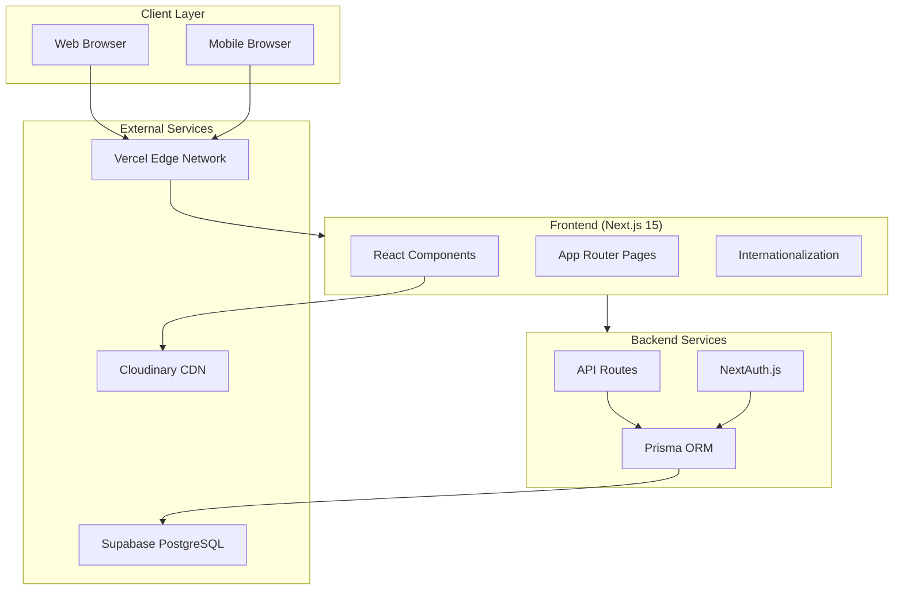

### 2.2 Request Flow

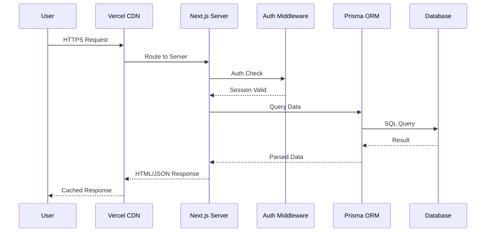

### 2.3 Directory Structure

```
clover-cosplay/
├── src/
│   ├── app/                    # Next.js App Router
│   │   ├── [locale]/           # Internationalized routes
│   │   │   ├── (user)/         # User-facing pages
│   │   │   ├── admin/          # Admin dashboard
│   │   │   ├── login/          # Authentication
│   │   │   └── register/       # Registration
│   │   ├── api/                # API endpoints
│   │   └── globals.css         # Global styles
│   ├── components/             # Reusable components
│   │   ├── admin/              # Admin components
│   │   ├── layout/             # Layout components
│   │   ├── products/           # Product components
│   │   └── ui/                 # UI primitives
│   ├── lib/                    # Utilities & configs
│   └── types/                  # TypeScript types
├── prisma/
│   └── schema.prisma           # Database schema
├── messages/                   # i18n translations
│   ├── en.json
│   └── th.json
└── public/                     # Static assets
```

---

## 3. Technology Stack

### 3.1 Frontend Technologies

| Technology | Version | Purpose |
|------------|---------|---------|
| **Next.js** | 15.1.6 | React framework with App Router |
| **React** | 19.0.0 | UI component library |
| **TypeScript** | 5.x | Type-safe development |
| **Tailwind CSS** | 3.4.17 | Utility-first styling |
| **Framer Motion** | 11.x | Animation library |
| **Lucide React** | 0.469.0 | Icon library |

### 3.2 Backend Technologies

| Technology | Version | Purpose |
|------------|---------|---------|
| **NextAuth.js** | 4.24.11 | Authentication |
| **Prisma** | 6.2.1 | Database ORM |
| **bcryptjs** | 2.4.3 | Password hashing |
| **Zod** | 3.x | Schema validation |

### 3.3 Infrastructure

| Service | Purpose |
|---------|---------|
| **Vercel** | Hosting & CDN |
| **Supabase** | PostgreSQL database |
| **Cloudinary** | Image storage & optimization |

### 3.4 Development Tools

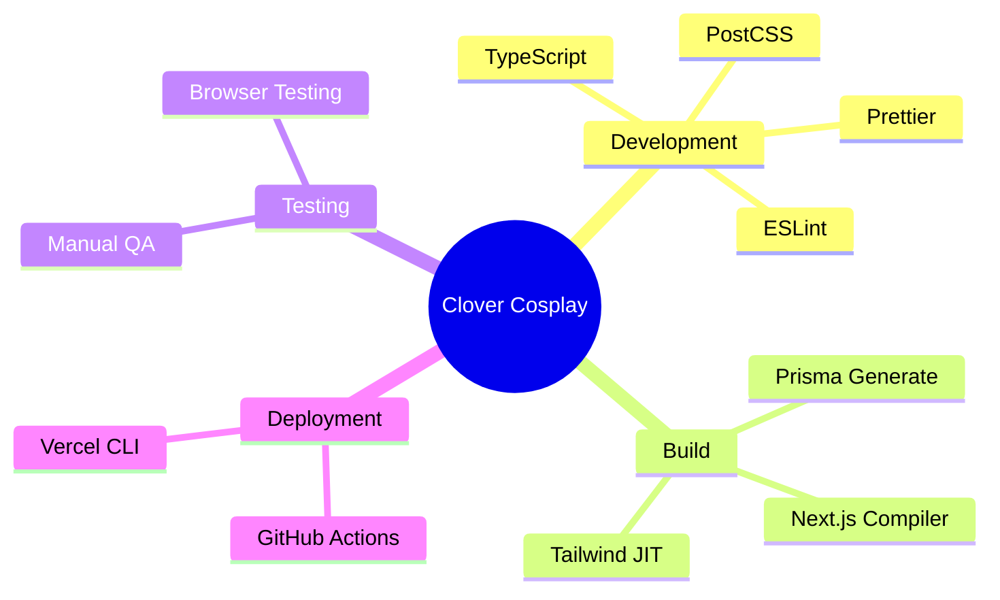

---

## 4. Database Design

### 4.1 Entity Relationship Diagram

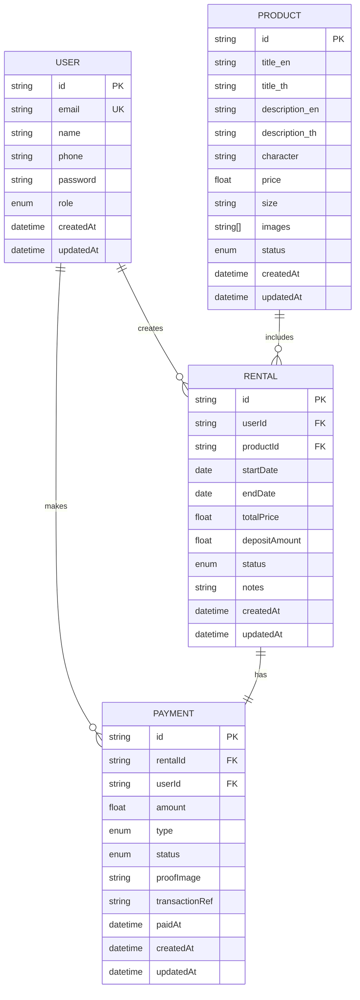

### 4.2 Database Tables

#### Users Table

| Column | Type | Constraints | Description |
|--------|------|-------------|-------------|
| id | String | PK, CUID | Unique identifier |
| email | String | Unique, Not Null | User email address |
| name | String | Not Null | Display name |
| phone | String | Nullable | Contact number |
| password | String | Not Null | Bcrypt hashed |
| role | Enum | Default: USER | USER or ADMIN |
| createdAt | DateTime | Auto | Creation timestamp |
| updatedAt | DateTime | Auto | Last update timestamp |

#### Products Table

| Column | Type | Constraints | Description |
|--------|------|-------------|-------------|
| id | String | PK, CUID | Unique identifier |
| title_en | String | Not Null | English title |
| title_th | String | Not Null | Thai title |
| description_en | Text | Nullable | English description |
| description_th | Text | Nullable | Thai description |
| character | String | Not Null | Character name |
| price | Float | Not Null | Daily rental price |
| size | String | Not Null | Costume size |
| images | String[] | Array | Image URLs |
| status | Enum | Default: AVAILABLE | Availability status |

#### Rentals Table

| Column | Type | Constraints | Description |
|--------|------|-------------|-------------|
| id | String | PK, CUID | Unique identifier |
| userId | String | FK → User | Renter reference |
| productId | String | FK → Product | Costume reference |
| startDate | DateTime | Not Null | Rental start date |
| endDate | DateTime | Not Null | Rental end date |
| totalPrice | Float | Not Null | Total rental cost |
| depositAmount | Float | Not Null | Security deposit |
| status | Enum | Default: PENDING | Rental status |

---

## 5. Application Features

### 5.1 Feature Overview

```mermaid
flowchart LR
    subgraph Public["Public Features"]
        A[Browse Costumes]
        B[View Details]
        C[Search & Filter]
        D[View Rules]
    end

    subgraph User["User Features"]
        E[User Registration]
        F[User Login]
        G[Book Costume]
        H[Upload Payment]
        I[Track Rentals]
    end

    subgraph Admin["Admin Features"]
        J[Manage Products]
        K[Process Rentals]
        L[Verify Payments]
        M[User Management]
    end

    Public --> User
    User --> Admin
```

### 5.2 User Role Capabilities

| Feature | Guest | User | Admin |
|---------|:-----:|:----:|:-----:|
| Browse costumes | ✅ | ✅ | ✅ |
| View costume details | ✅ | ✅ | ✅ |
| Search & filter | ✅ | ✅ | ✅ |
| View rental rules | ✅ | ✅ | ✅ |
| Create account | ✅ | ❌ | ❌ |
| Make bookings | ❌ | ✅ | ✅ |
| Upload payment proof | ❌ | ✅ | ✅ |
| View my rentals | ❌ | ✅ | ✅ |
| Manage products | ❌ | ❌ | ✅ |
| Process rentals | ❌ | ❌ | ✅ |
| Verify payments | ❌ | ❌ | ✅ |
| Manage users | ❌ | ❌ | ✅ |

### 5.3 Rental Workflow

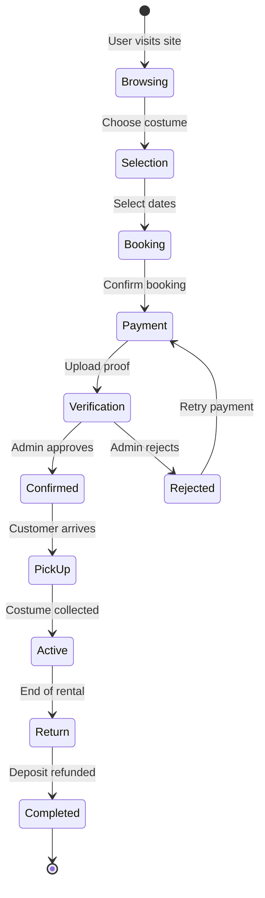

### 5.4 Internationalization (i18n)

The application supports two languages with seamless switching:

| Feature | Implementation |
|---------|---------------|
| **Routing** | URL-based locale (`/en/`, `/th/`) |
| **Detection** | Browser preference detection |
| **Fallback** | English as default |
| **Content** | Product titles & descriptions in both languages |
| **UI Elements** | Full UI translation |

---

## 6. User Interface Gallery

### 6.1 Landing Page

The landing page features a modern, dark-themed design with animated elements and clear call-to-action buttons.

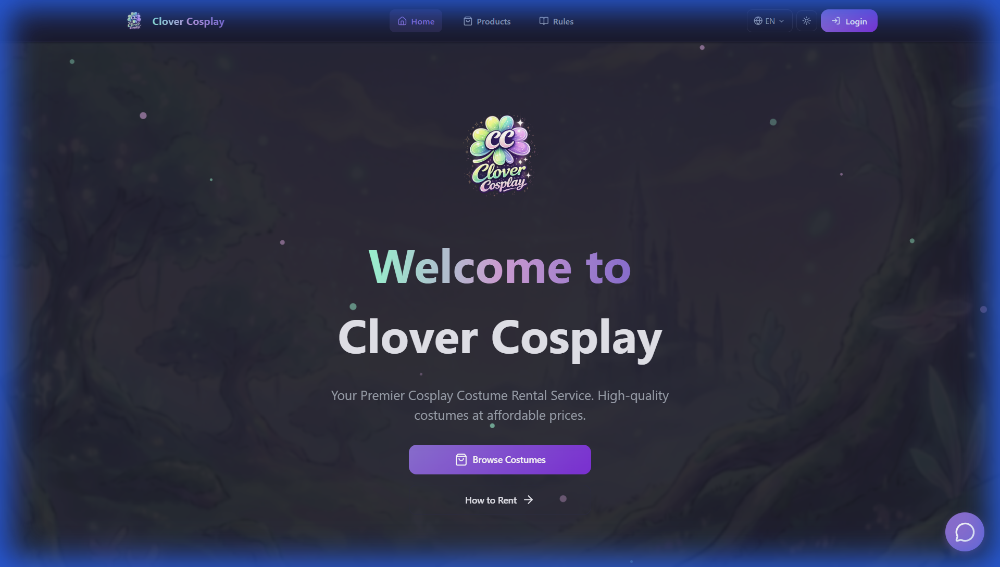

**Key Elements:**
- Animated logo with gradient effects
- Clear value proposition
- Primary CTA: "Browse Costumes"
- Secondary CTA: "How to Rent"

### 6.2 How It Works Section

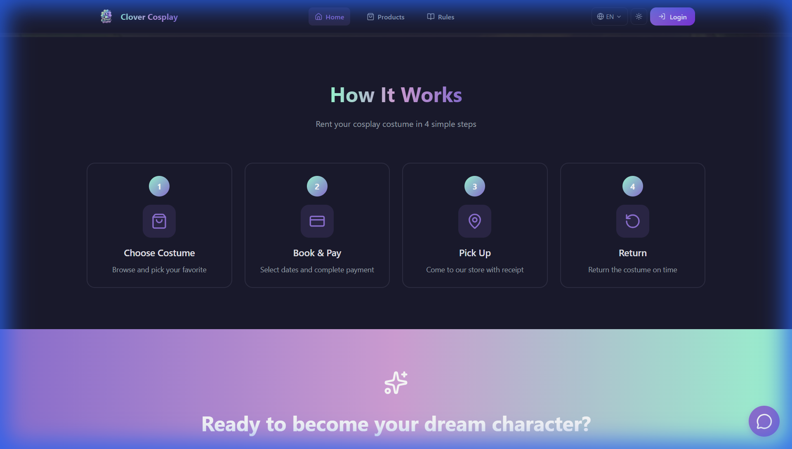

**Four-Step Process:**
1. **Choose Costume** - Browse and pick favorites
2. **Book & Pay** - Select dates and complete payment
3. **Pick Up** - Visit store with receipt
4. **Return** - Return costume on time

### 6.3 Call-to-Action Section

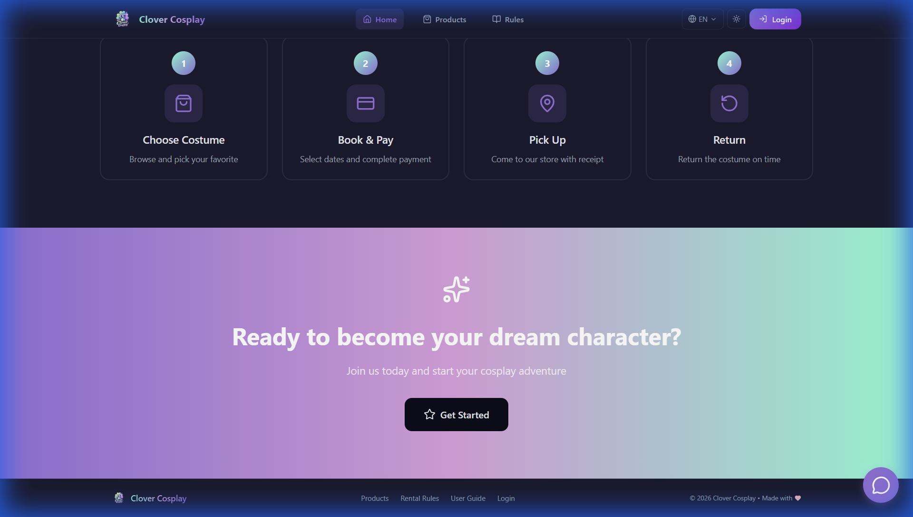

**Design Features:**
- Gradient background (purple to pink)
- Engaging headline
- Prominent action button

### 6.4 Products Catalog

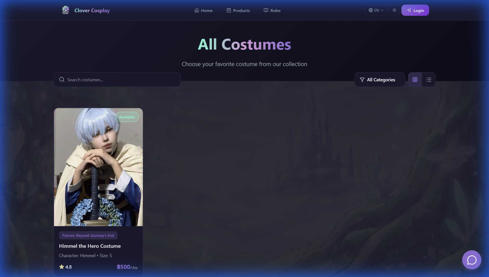

**Features:**
- Grid/List view toggle
- Category filtering
- Search functionality
- Availability badges
- Rating display
- Price information

### 6.5 Rental Rules Page

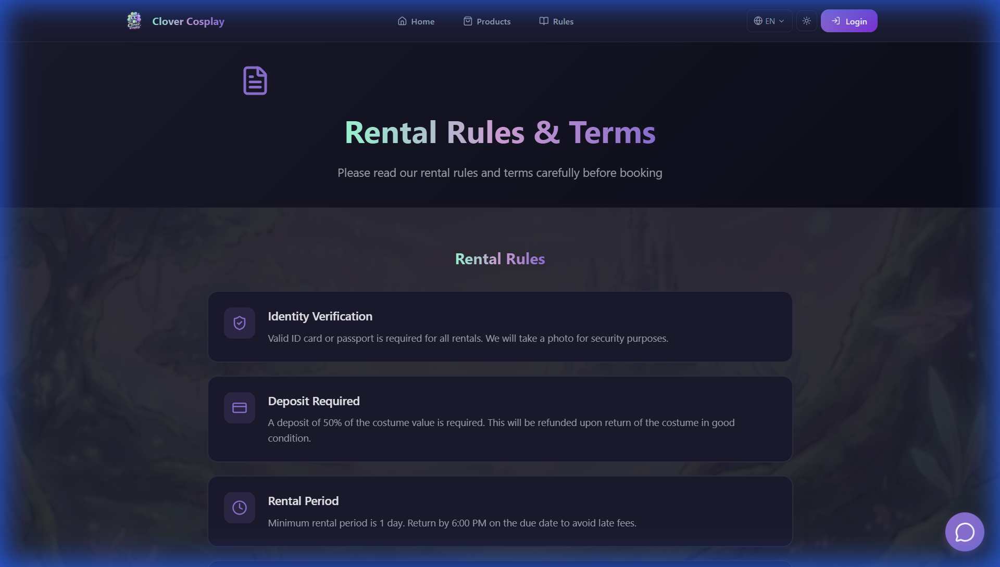

**Displayed Rules:**
- Identity verification requirements
- Deposit policy (50% of costume value)
- Rental period terms
- Return conditions

### 6.6 Authentication Pages

**Login Page:**


**Registration Page:**

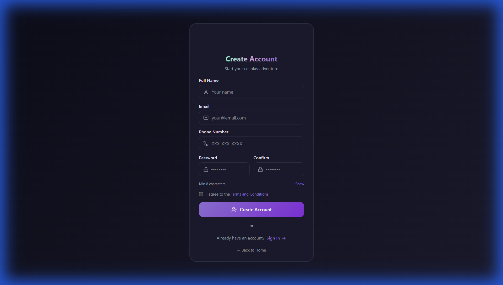

**Form Features:**
- Email/password authentication
- Password visibility toggle
- Terms & conditions acceptance
- Link between login/register

---

## 7. Security Implementation

### 7.1 Authentication Flow

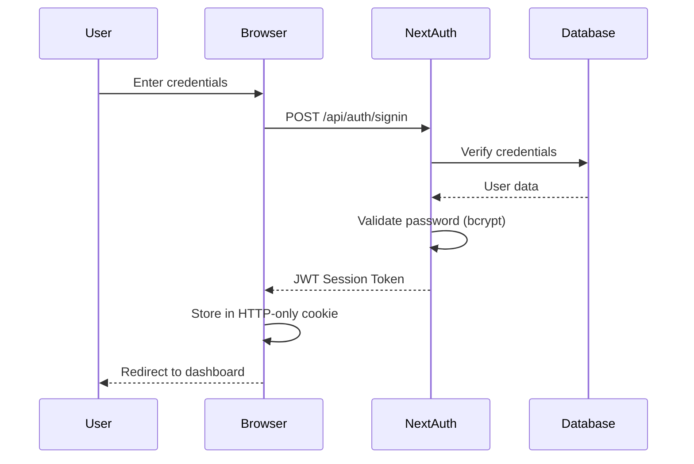

### 7.2 Security Measures

| Layer | Implementation |
|-------|---------------|
| **Password** | bcrypt hashing with salt |
| **Sessions** | JWT tokens with expiration |
| **Cookies** | HTTP-only, Secure, SameSite |
| **API Routes** | Server-side session validation |
| **Admin Routes** | Role-based middleware protection |
| **Input** | Zod schema validation |
| **Database** | Prisma parameterized queries |

### 7.3 Route Protection

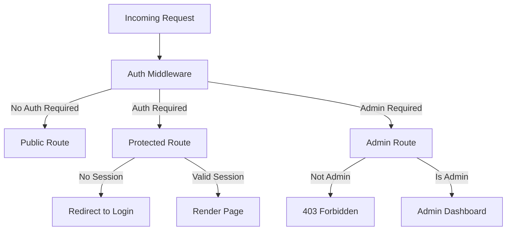

---

## 8. Deployment & Infrastructure

### 8.1 Deployment Architecture

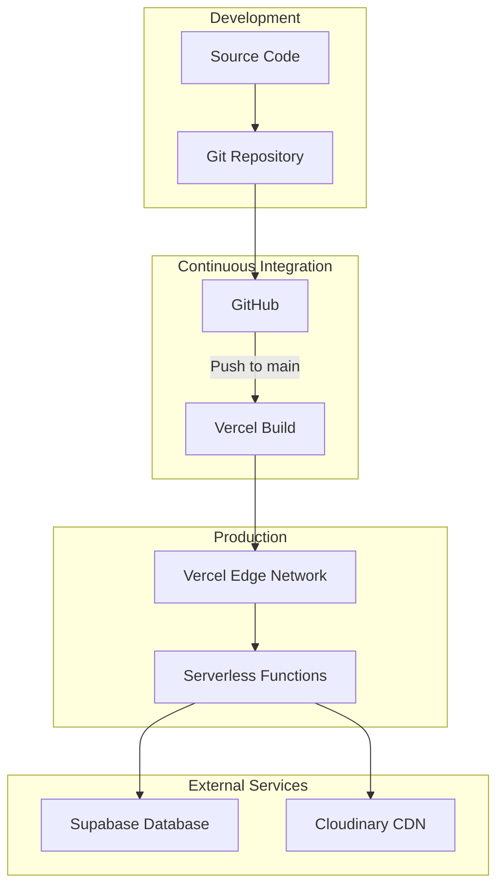

### 8.2 Environment Configuration

| Variable | Purpose | Environment |
|----------|---------|-------------|
| `DATABASE_URL` | PostgreSQL connection | Production |
| `DIRECT_URL` | Direct database access | Production |
| `NEXTAUTH_SECRET` | JWT signing secret | Production |
| `NEXTAUTH_URL` | Auth callback base URL | Production |
| `CLOUDINARY_CLOUD_NAME` | Image CDN account | All |
| `CLOUDINARY_API_KEY` | CDN authentication | All |
| `CLOUDINARY_API_SECRET` | CDN secret | All |

### 8.3 Performance Optimizations

- **Edge Caching**: Static assets cached globally
- **Image Optimization**: Cloudinary automatic format/size
- **Code Splitting**: Automatic route-based splitting
- **Database Pooling**: Supabase connection pooling
- **Incremental Static Regeneration**: Dynamic content updates

---

## 9. API Documentation

### 9.1 API Endpoints Overview

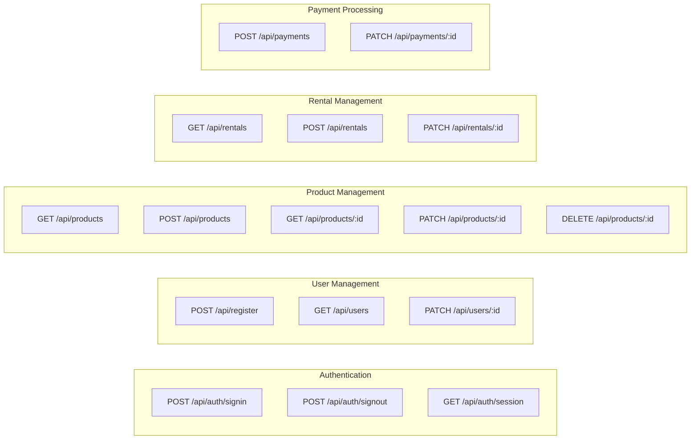

### 9.2 Key API Endpoints

#### Authentication

| Endpoint | Method | Description |
|----------|--------|-------------|
| `/api/auth/signin` | POST | User login |
| `/api/auth/signout` | POST | User logout |
| `/api/auth/session` | GET | Get current session |
| `/api/register` | POST | New user registration |

#### Products

| Endpoint | Method | Auth | Description |
|----------|--------|------|-------------|
| `/api/products` | GET | Public | List all products |
| `/api/products` | POST | Admin | Create product |
| `/api/products/:id` | GET | Public | Get product details |
| `/api/products/:id` | PATCH | Admin | Update product |
| `/api/products/:id` | DELETE | Admin | Delete product |

#### Rentals

| Endpoint | Method | Auth | Description |
|----------|--------|------|-------------|
| `/api/rentals` | GET | User | List user rentals |
| `/api/rentals` | POST | User | Create rental |
| `/api/rentals/:id` | PATCH | Admin | Update rental status |

---

## 10. Future Enhancements

### 10.1 Planned Features

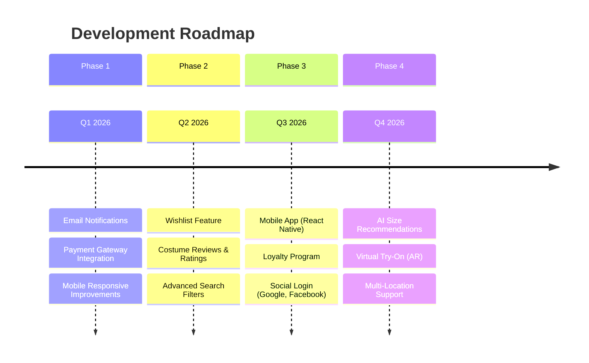

### 10.2 Technical Improvements

| Area | Enhancement | Priority |
|------|-------------|----------|
| **Performance** | Redis caching layer | High |
| **Testing** | E2E tests with Playwright | High |
| **Monitoring** | Error tracking (Sentry) | Medium |
| **Analytics** | User behavior tracking | Medium |
| **SEO** | Structured data markup | Medium |
| **Accessibility** | WCAG 2.1 compliance | Medium |

### 10.3 Business Features

- **Online Payment**: Integration with PromptPay, credit cards
- **Reservation Calendar**: Visual availability calendar
- **Package Deals**: Bundle discounts for multiple items
- **Referral Program**: User referral incentives
- **Damage Insurance**: Optional protection plans

---

## Appendix

### A. Quick Start Guide

```bash
# Clone repository
git clone https://github.com/user/clover-cosplay.git
cd clover-cosplay

# Install dependencies
npm install

# Setup environment
cp .env.example .env
# Edit .env with your credentials

# Generate Prisma client
npx prisma generate

# Push database schema
npx prisma db push

# Run development server
npm run dev
```

### B. Admin Access

Default admin credentials for testing:
- **Email**: admin@example.com
- **Password**: (Set during initial setup)

### C. Support

For technical support or inquiries:
- **Website**: https://clover-cosplay.vercel.app
- **Email**: support@clovercosplay.com

---

> **Document prepared by**: Development Team  
> **Last Updated**: January 23, 2026  
> **Version**: 1.0.0
