# Clover Cosplay - รายงานโปรเจกต์

> **เวอร์ชัน**: 1.0.0  
> **เว็บไซต์**: [https://clover-cosplay.vercel.app](https://clover-cosplay.vercel.app)  
> **วันที่รายงาน**: 23 มกราคม 2569

---

## สารบัญ

1. [บทสรุปผู้บริหาร](#1-บทสรุปผู้บริหาร)
2. [สถาปัตยกรรมระบบ](#2-สถาปัตยกรรมระบบ)
3. [เทคโนโลยีที่ใช้](#3-เทคโนโลยีที่ใช้)
4. [การออกแบบฐานข้อมูล](#4-การออกแบบฐานข้อมูล)
5. [ฟีเจอร์ของแอปพลิเคชัน](#5-ฟีเจอร์ของแอปพลิเคชัน)
6. [แกลเลอรีหน้าจอ](#6-แกลเลอรีหน้าจอ)
7. [การรักษาความปลอดภัย](#7-การรักษาความปลอดภัย)
8. [การติดตั้งและโครงสร้างพื้นฐาน](#8-การติดตั้งและโครงสร้างพื้นฐาน)
9. [เอกสาร API](#9-เอกสาร-api)
10. [การพัฒนาในอนาคต](#10-การพัฒนาในอนาคต)

---

## 1. บทสรุปผู้บริหาร

**Clover Cosplay** คือระบบจัดการการเช่าชุดคอสเพลย์ออนไลน์ที่ครบวงจร ออกแบบมาเพื่อผู้หลงใหลในการคอสเพลย์โดยเฉพาะ แพลตฟอร์มนี้ช่วยให้ผู้ใช้สามารถเรียกดู จอง และเช่าชุดคอสเพลย์คุณภาพสูงผ่านอินเทอร์เฟซที่ใช้งานง่าย รองรับทั้งภาษาไทยและอังกฤษ

### จุดเด่นของระบบ

| หัวข้อ | รายละเอียด |
|--------|-------------|
| **กลุ่มผู้ใช้เป้าหมาย** | ผู้ชื่นชอบคอสเพลย์ ผู้เข้าร่วมงานอีเวนต์ ช่างภาพ |
| **ฟังก์ชันหลัก** | การเช่าชุดออนไลน์พร้อมระบบจัดการการจอง |
| **ภาษา** | อังกฤษ (EN) และ ไทย (TH) |
| **การยืนยันตัวตน** | อีเมล/รหัสผ่าน พร้อม JWT sessions |
| **การชำระเงิน** | ตรวจสอบด้วยตนเองผ่านการโอนเงิน/QR payment |

### คุณค่าทางธุรกิจ

- **การดำเนินการที่คล่องตัว**: ระบบจองและจัดการสินค้าคงคลังอัตโนมัติ
- **ประสบการณ์ผู้ใช้ที่ยอดเยี่ยม**: ดีไซน์ทันสมัย ตอบสนองทุกอุปกรณ์ พร้อมธีมมืด
- **ปรับขนาดได้**: สถาปัตยกรรม Cloud-native พร้อมเติบโต
- **ความปลอดภัยเป็นอันดับแรก**: การยืนยันตัวตนและการปกป้องข้อมูลตามมาตรฐานสากล

---

## 2. สถาปัตยกรรมระบบ

### 2.1 สถาปัตยกรรมระดับสูง

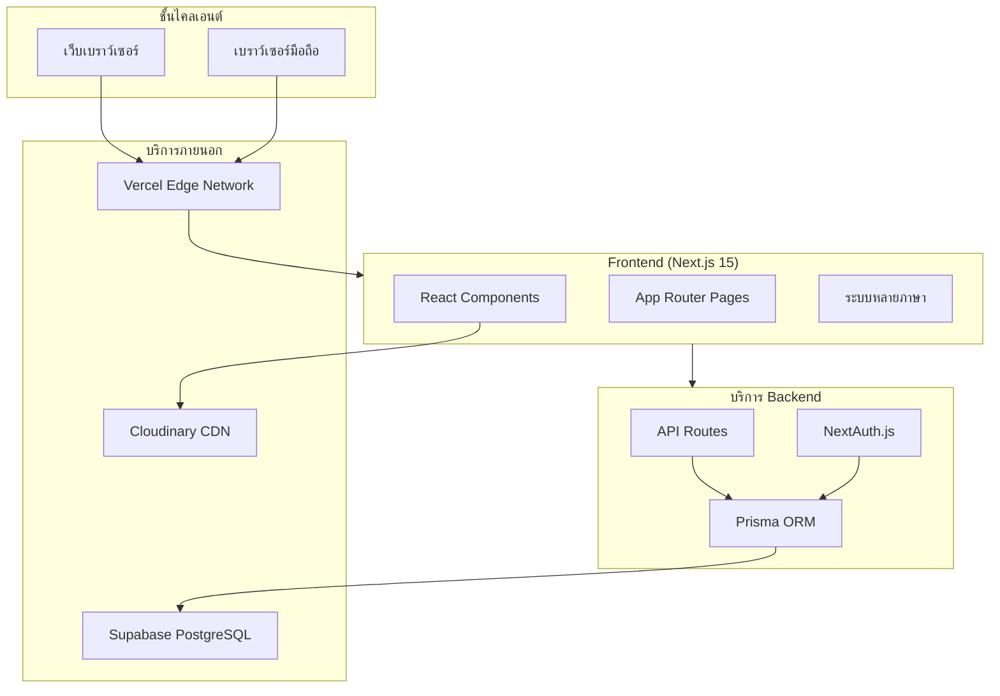

### 2.2 ขั้นตอนการรับส่งข้อมูล

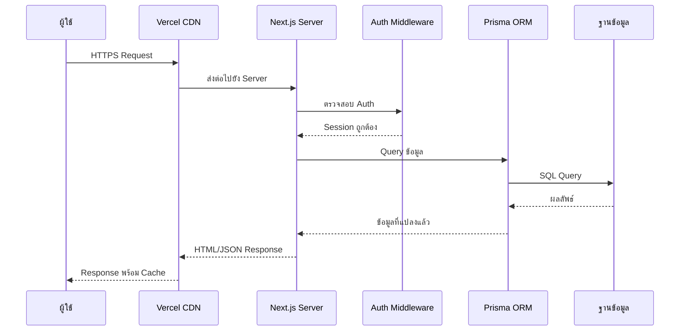

### 2.3 โครงสร้างไดเรกทอรี

```
clover-cosplay/
├── src/
│   ├── app/                    # Next.js App Router
│   │   ├── [locale]/           # Routes แบบหลายภาษา
│   │   │   ├── (user)/         # หน้าสำหรับผู้ใช้
│   │   │   ├── admin/          # แดชบอร์ดผู้ดูแล
│   │   │   ├── login/          # เข้าสู่ระบบ
│   │   │   └── register/       # สมัครสมาชิก
│   │   ├── api/                # API endpoints
│   │   └── globals.css         # Style ทั่วไป
│   ├── components/             # Components ที่ใช้ซ้ำได้
│   │   ├── admin/              # Components ผู้ดูแล
│   │   ├── layout/             # Layout components
│   │   ├── products/           # Product components
│   │   └── ui/                 # UI พื้นฐาน
│   ├── lib/                    # Utilities & configs
│   └── types/                  # TypeScript types
├── prisma/
│   └── schema.prisma           # Schema ฐานข้อมูล
├── messages/                   # ไฟล์แปลภาษา
│   ├── en.json
│   └── th.json
└── public/                     # Static assets
```

---

## 3. เทคโนโลยีที่ใช้

### 3.1 เทคโนโลยี Frontend

| เทคโนโลยี | เวอร์ชัน | วัตถุประสงค์ |
|-----------|---------|--------------|
| **Next.js** | 15.1.6 | React framework พร้อม App Router |
| **React** | 19.0.0 | ไลบรารี UI component |
| **TypeScript** | 5.x | การพัฒนาแบบ Type-safe |
| **Tailwind CSS** | 3.4.17 | Styling แบบ Utility-first |
| **Framer Motion** | 11.x | ไลบรารี Animation |
| **Lucide React** | 0.469.0 | ไลบรารี Icon |

### 3.2 เทคโนโลยี Backend

| เทคโนโลยี | เวอร์ชัน | วัตถุประสงค์ |
|-----------|---------|--------------|
| **NextAuth.js** | 4.24.11 | การยืนยันตัวตน |
| **Prisma** | 6.2.1 | Database ORM |
| **bcryptjs** | 2.4.3 | การเข้ารหัสรหัสผ่าน |
| **Zod** | 3.x | การตรวจสอบ Schema |

### 3.3 โครงสร้างพื้นฐาน

| บริการ | วัตถุประสงค์ |
|--------|--------------|
| **Vercel** | Hosting & CDN |
| **Supabase** | ฐานข้อมูล PostgreSQL |
| **Cloudinary** | จัดเก็บและปรับแต่งรูปภาพ |

### 3.4 เครื่องมือพัฒนา

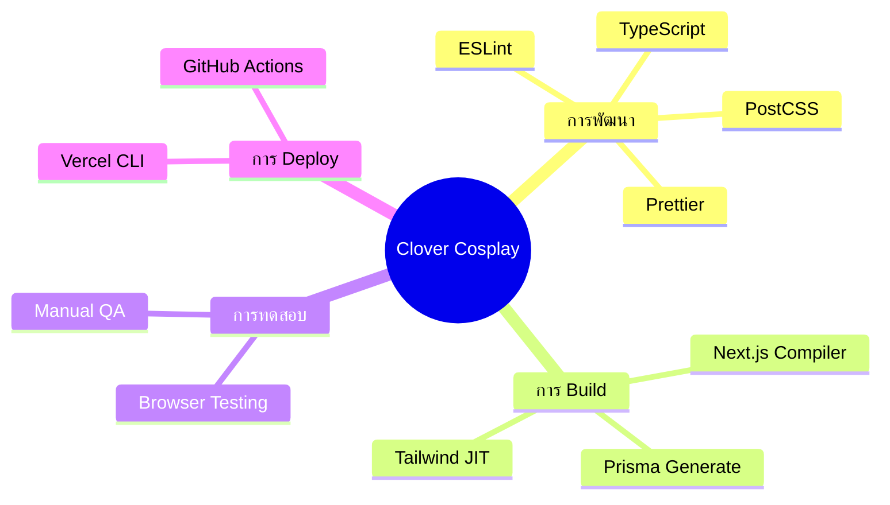

---

## 4. การออกแบบฐานข้อมูล

### 4.1 แผนภาพ Entity Relationship

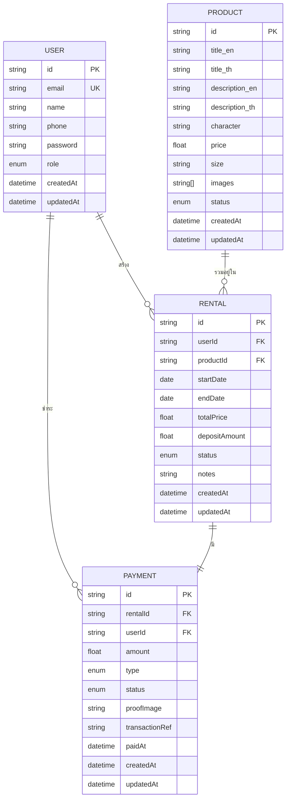

### 4.2 ตารางฐานข้อมูล

#### ตาราง Users

| คอลัมน์ | ชนิด | ข้อจำกัด | คำอธิบาย |
|---------|------|----------|----------|
| id | String | PK, CUID | ตัวระบุเฉพาะ |
| email | String | Unique, Not Null | อีเมลผู้ใช้ |
| name | String | Not Null | ชื่อแสดง |
| phone | String | Nullable | เบอร์โทรศัพท์ |
| password | String | Not Null | เข้ารหัสด้วย Bcrypt |
| role | Enum | Default: USER | USER หรือ ADMIN |
| createdAt | DateTime | Auto | เวลาสร้าง |
| updatedAt | DateTime | Auto | เวลาอัปเดตล่าสุด |

#### ตาราง Products

| คอลัมน์ | ชนิด | ข้อจำกัด | คำอธิบาย |
|---------|------|----------|----------|
| id | String | PK, CUID | ตัวระบุเฉพาะ |
| title_en | String | Not Null | ชื่อภาษาอังกฤษ |
| title_th | String | Not Null | ชื่อภาษาไทย |
| description_en | Text | Nullable | คำอธิบายภาษาอังกฤษ |
| description_th | Text | Nullable | คำอธิบายภาษาไทย |
| character | String | Not Null | ชื่อตัวละคร |
| price | Float | Not Null | ราคาเช่าต่อวัน |
| size | String | Not Null | ขนาดชุด |
| images | String[] | Array | URL รูปภาพ |
| status | Enum | Default: AVAILABLE | สถานะความพร้อม |

#### ตาราง Rentals

| คอลัมน์ | ชนิด | ข้อจำกัด | คำอธิบาย |
|---------|------|----------|----------|
| id | String | PK, CUID | ตัวระบุเฉพาะ |
| userId | String | FK → User | อ้างอิงผู้เช่า |
| productId | String | FK → Product | อ้างอิงชุด |
| startDate | DateTime | Not Null | วันเริ่มเช่า |
| endDate | DateTime | Not Null | วันสิ้นสุดการเช่า |
| totalPrice | Float | Not Null | ราคารวม |
| depositAmount | Float | Not Null | ค่ามัดจำ |
| status | Enum | Default: PENDING | สถานะการเช่า |

---

## 5. ฟีเจอร์ของแอปพลิเคชัน

### 5.1 ภาพรวมฟีเจอร์

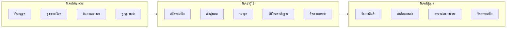

### 5.2 สิทธิ์ตามบทบาท

| ฟีเจอร์ | ผู้เยี่ยมชม | ผู้ใช้ | ผู้ดูแล |
|---------|:----------:|:-----:|:------:|
| เรียกดูชุด | ✅ | ✅ | ✅ |
| ดูรายละเอียดชุด | ✅ | ✅ | ✅ |
| ค้นหาและกรอง | ✅ | ✅ | ✅ |
| ดูกฎการเช่า | ✅ | ✅ | ✅ |
| สมัครสมาชิก | ✅ | ❌ | ❌ |
| ทำการจอง | ❌ | ✅ | ✅ |
| อัปโหลดหลักฐานการชำระ | ❌ | ✅ | ✅ |
| ดูรายการเช่าของฉัน | ❌ | ✅ | ✅ |
| จัดการสินค้า | ❌ | ❌ | ✅ |
| ดำเนินการเช่า | ❌ | ❌ | ✅ |
| ตรวจสอบการชำระ | ❌ | ❌ | ✅ |
| จัดการสมาชิก | ❌ | ❌ | ✅ |

### 5.3 ขั้นตอนการเช่า

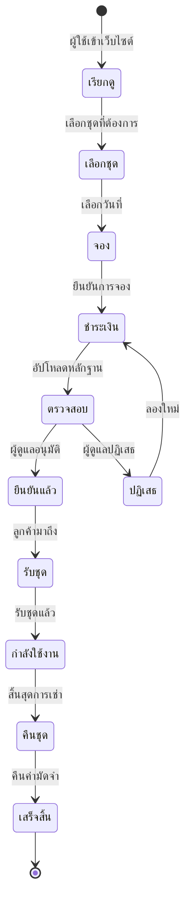

### 5.4 ระบบหลายภาษา (i18n)

แอปพลิเคชันรองรับสองภาษาพร้อมการสลับที่ราบรื่น:

| ฟีเจอร์ | การใช้งาน |
|---------|-----------|
| **Routing** | Locale ใน URL (`/en/`, `/th/`) |
| **ตรวจจับอัตโนมัติ** | ตรวจจับจากเบราว์เซอร์ |
| **ค่าเริ่มต้น** | ภาษาอังกฤษ |
| **เนื้อหา** | ชื่อและคำอธิบายสินค้าทั้งสองภาษา |
| **UI Elements** | แปล UI ครบถ้วน |

---

## 6. แกลเลอรีหน้าจอ

### 6.1 หน้าแรก

หน้าแรกมีดีไซน์ธีมมืดที่ทันสมัยพร้อม animation และปุ่ม call-to-action ที่ชัดเจน


**องค์ประกอบหลัก:**
- โลโก้พร้อม animation และ gradient effects
- ข้อความคุณค่าที่ชัดเจน
- CTA หลัก: "เรียกดูชุด"
- CTA รอง: "วิธีการเช่า"

### 6.2 ส่วน "ขั้นตอนการเช่า"


**กระบวนการ 4 ขั้นตอน:**
1. **เลือกชุด** - เรียกดูและเลือกชุดที่ชอบ
2. **จองและชำระ** - เลือกวันที่และชำระเงิน
3. **รับชุด** - มาที่ร้านพร้อมใบเสร็จ
4. **คืนชุด** - คืนชุดตรงเวลา

### 6.3 ส่วน Call-to-Action


**คุณสมบัติดีไซน์:**
- พื้นหลัง gradient (ม่วงไปชมพู)
- หัวข้อที่ดึงดูดความสนใจ
- ปุ่มกระทำที่โดดเด่น

### 6.4 แคตตาล็อกชุด


**ฟีเจอร์:**
- สลับมุมมอง Grid/List
- กรองตามหมวดหมู่
- ฟังก์ชันค้นหา
- ป้ายแสดงสถานะ
- แสดงคะแนน
- ข้อมูลราคา

### 6.5 หน้ากฎการเช่า


**กฎที่แสดง:**
- ข้อกำหนดการยืนยันตัวตน
- นโยบายค่ามัดจำ (50% ของมูลค่าชุด)
- เงื่อนไขระยะเวลาเช่า
- เงื่อนไขการคืน

### 6.6 หน้ายืนยันตัวตน

**หน้าเข้าสู่ระบบ:**


**หน้าสมัครสมาชิก:**


**ฟีเจอร์ฟอร์ม:**
- ยืนยันตัวตนด้วยอีเมล/รหัสผ่าน
- ปุ่มแสดง/ซ่อนรหัสผ่าน
- ยอมรับข้อกำหนดและเงื่อนไข
- ลิงก์เชื่อมระหว่างหน้า login/register

---

## 7. การรักษาความปลอดภัย

### 7.1 ขั้นตอนการยืนยันตัวตน

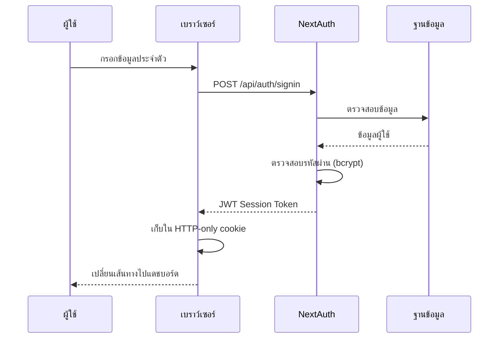

### 7.2 มาตรการความปลอดภัย

| ชั้น | การใช้งาน |
|------|-----------|
| **รหัสผ่าน** | bcrypt hashing พร้อม salt |
| **Sessions** | JWT tokens พร้อมวันหมดอายุ |
| **Cookies** | HTTP-only, Secure, SameSite |
| **API Routes** | ตรวจสอบ session ฝั่ง server |
| **Admin Routes** | ป้องกันด้วย middleware ตามบทบาท |
| **Input** | ตรวจสอบด้วย Zod schema |
| **Database** | Prisma parameterized queries |

### 7.3 การป้องกัน Route

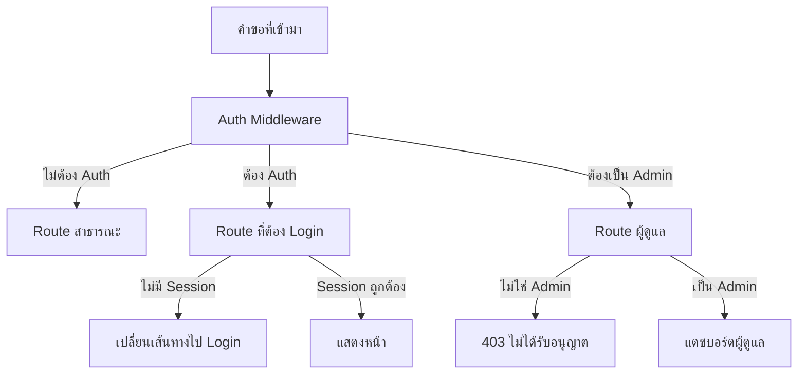

---

## 8. การติดตั้งและโครงสร้างพื้นฐาน

### 8.1 สถาปัตยกรรมการ Deploy

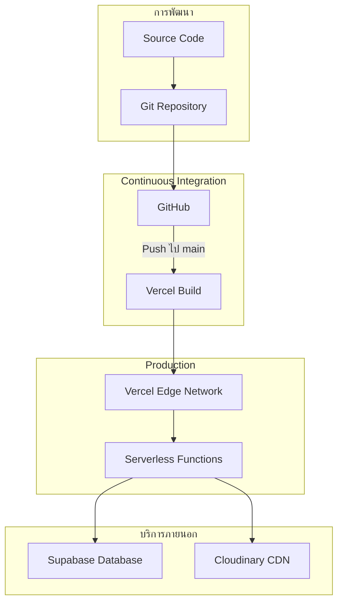

### 8.2 การตั้งค่า Environment

| ตัวแปร | วัตถุประสงค์ | Environment |
|--------|--------------|-------------|
| `DATABASE_URL` | เชื่อมต่อ PostgreSQL | Production |
| `DIRECT_URL` | เข้าถึงฐานข้อมูลโดยตรง | Production |
| `NEXTAUTH_SECRET` | Secret สำหรับเซ็น JWT | Production |
| `NEXTAUTH_URL` | Base URL สำหรับ Auth callback | Production |
| `CLOUDINARY_CLOUD_NAME` | บัญชี Image CDN | ทั้งหมด |
| `CLOUDINARY_API_KEY` | ยืนยันตัวตน CDN | ทั้งหมด |
| `CLOUDINARY_API_SECRET` | Secret CDN | ทั้งหมด |

### 8.3 การปรับแต่งประสิทธิภาพ

- **Edge Caching**: Cache static assets ทั่วโลก
- **Image Optimization**: Cloudinary ปรับรูปแบบ/ขนาดอัตโนมัติ
- **Code Splitting**: แบ่งโค้ดตาม route อัตโนมัติ
- **Database Pooling**: Supabase connection pooling
- **Incremental Static Regeneration**: อัปเดตเนื้อหาแบบ dynamic

---

## 9. เอกสาร API

### 9.1 ภาพรวม API Endpoints

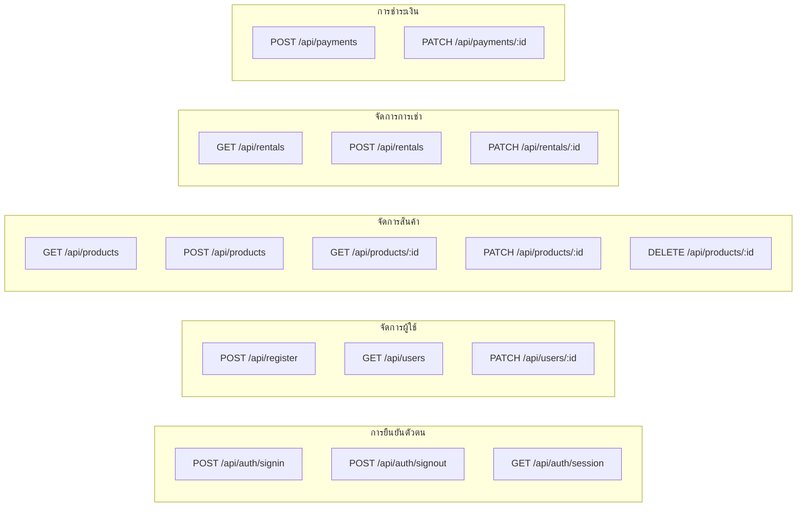

### 9.2 API Endpoints หลัก

#### การยืนยันตัวตน

| Endpoint | Method | คำอธิบาย |
|----------|--------|----------|
| `/api/auth/signin` | POST | เข้าสู่ระบบ |
| `/api/auth/signout` | POST | ออกจากระบบ |
| `/api/auth/session` | GET | ดึง session ปัจจุบัน |
| `/api/register` | POST | สมัครสมาชิกใหม่ |

#### สินค้า

| Endpoint | Method | Auth | คำอธิบาย |
|----------|--------|------|----------|
| `/api/products` | GET | สาธารณะ | แสดงรายการสินค้าทั้งหมด |
| `/api/products` | POST | Admin | สร้างสินค้าใหม่ |
| `/api/products/:id` | GET | สาธารณะ | ดึงรายละเอียดสินค้า |
| `/api/products/:id` | PATCH | Admin | อัปเดตสินค้า |
| `/api/products/:id` | DELETE | Admin | ลบสินค้า |

#### การเช่า

| Endpoint | Method | Auth | คำอธิบาย |
|----------|--------|------|----------|
| `/api/rentals` | GET | User | แสดงรายการเช่าของผู้ใช้ |
| `/api/rentals` | POST | User | สร้างการเช่าใหม่ |
| `/api/rentals/:id` | PATCH | Admin | อัปเดตสถานะการเช่า |

---

## 10. การพัฒนาในอนาคต

### 10.1 ฟีเจอร์ที่วางแผนไว้

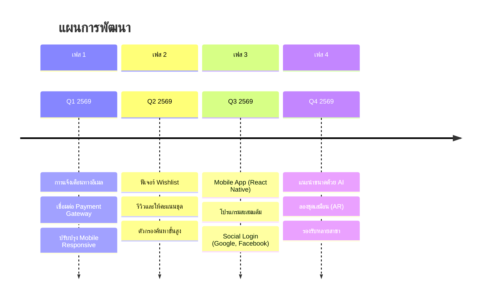

### 10.2 การปรับปรุงทางเทคนิค

| ด้าน | การปรับปรุง | ความสำคัญ |
|------|-------------|-----------|
| **ประสิทธิภาพ** | Redis caching layer | สูง |
| **การทดสอบ** | E2E tests ด้วย Playwright | สูง |
| **การตรวจสอบ** | Error tracking (Sentry) | ปานกลาง |
| **Analytics** | ติดตามพฤติกรรมผู้ใช้ | ปานกลาง |
| **SEO** | Structured data markup | ปานกลาง |
| **Accessibility** | WCAG 2.1 compliance | ปานกลาง |

### 10.3 ฟีเจอร์ทางธุรกิจ

- **ชำระเงินออนไลน์**: เชื่อมต่อ PromptPay, บัตรเครดิต
- **ปฏิทินการจอง**: ปฏิทินแสดงความพร้อมของชุด
- **แพ็กเกจ**: ส่วนลดเมื่อเช่าหลายชิ้น
- **โปรแกรมแนะนำเพื่อน**: รางวัลเมื่อแนะนำผู้ใช้ใหม่
- **ประกันความเสียหาย**: แผนคุ้มครองเพิ่มเติม

---

## ภาคผนวก

### ก. คู่มือเริ่มต้นอย่างรวดเร็ว

```bash
# Clone repository
git clone https://github.com/user/clover-cosplay.git
cd clover-cosplay

# ติดตั้ง dependencies
npm install

# ตั้งค่า environment
cp .env.example .env
# แก้ไข .env ใส่ข้อมูลของคุณ

# สร้าง Prisma client
npx prisma generate

# Push schema ไปยังฐานข้อมูล
npx prisma db push

# รัน development server
npm run dev
```

### ข. การเข้าถึงผู้ดูแล

ข้อมูลผู้ดูแลเริ่มต้นสำหรับทดสอบ:
- **อีเมล**: admin@example.com
- **รหัสผ่าน**: (ตั้งค่าตอนติดตั้งครั้งแรก)

### ค. การสนับสนุน

สำหรับการสนับสนุนทางเทคนิคหรือสอบถาม:
- **เว็บไซต์**: https://clover-cosplay.vercel.app
- **อีเมล**: support@clovercosplay.com

---

> **จัดทำโดย**: ทีมพัฒนา  
> **อัปเดตล่าสุด**: 23 มกราคม 2569  
> **เวอร์ชัน**: 1.0.0
